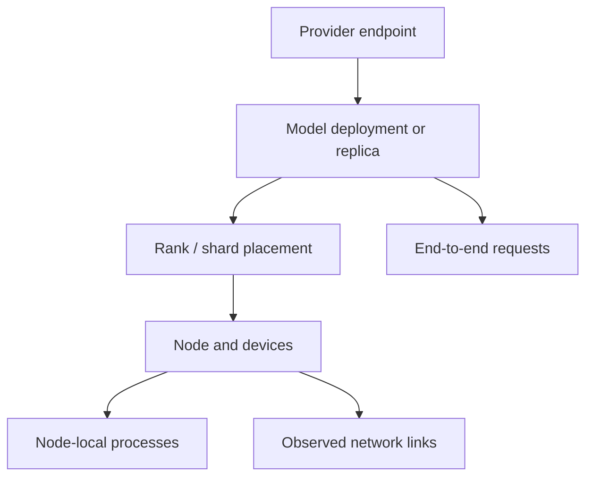

# Distributed monitoring: research and proposed design

Research date: **2026-09-24**. Status: **proposal; no monitoring implementation changed**.

mlxtop needs to represent a model deployment spanning several machines, with
separate deployment, node, rank and request identities. Adding more remote
endpoints to the existing single-host sample would not provide reliable
distributed monitoring: throughput, memory and health have different scopes.

Recommended order: introduce the shared data model and oMLX deployment view,
then add exo, then worker collection for runtimes without a cluster telemetry API.

## Baseline and release findings

`git fetch origin` and `git pull --ff-only origin main` completed. The pull
reported **Already up to date**. `origin/main` is `f7962ad`; this work starts at
`71384b0`, one commit ahead, including the Bionic process-detection fix.
The new branch is `research/distributed-monitoring`.

Existing edits in `src/request_dashboard.rs`, `docs/USER_GUIDE.md` and
`docs/UX_DESIGN.md` were preserved. They are unrelated to this proposal.

| oMLX release | Published (UTC) | Relevant capability changes |
| --- | --- | --- |
| `0.7.0.dev1` | September 10 | Cluster v2 deployment and worker lifecycle, persistent prompt snapshots, local usage history, improved concurrent prefill. [Release notes](https://github.com/jundot/omlx/releases/tag/v0.7.0.dev1). |
| `0.7.0.dev2` | September 11 | DeepSeek V4.1 with DSpark MTP and Engram offload, experimental MoE expert offload, M5 prefill optimizations. [Release notes](https://github.com/jundot/omlx/releases/tag/v0.7.0.dev2). |
| `0.7.0.dev4` | September 18 | Concurrent Lightning MTP, benchmark recipes, customizable dashboard, optional DeepSeek CED prefill, further offload improvements. [Release notes](https://github.com/jundot/omlx/releases/tag/v0.7.0.dev4). |
| `0.7.0rc1` | September 24 | Batched DFlash, adaptive MTP depth, partial-block caching, broader offload, Mac/CUDA MCDMA stage links, additional multimodal models. [Release notes](https://github.com/jundot/omlx/releases/tag/v0.7.0rc1). |

The latest development tag is dev4; the newer release candidate is rc1. GitHub
marks rc1 as “Latest” and its API reports `prerelease=false`, but its name and
notes explicitly identify it as a release candidate. The latest final-version
release found is `0.6.4`. No dev3 release appears in the inspected release list.

The API analysis below is pinned to rc1, commit
`35be079d8a86a44dc2c6d485fbfbf43754e66298`, and compared with dev4 at `14194fe`.
Upstream main had already advanced to `3f2d07e` when checked; unreleased changes
after rc1 are outside this compatibility assessment. Benchmark gains in release
notes are workload-specific, not predictions for the user's machines.

## What mlxtop currently misses

The current [`LlmTelemetry` and client](../src/main.rs) describe one selected
provider/model and endpoint. [`providers.rs`](../src/providers.rs) selects one
runtime; its native llama.cpp/KoboldCpp requests go to loopback. `Sample` combines
these serving readings with local OS/process readings. There are no node,
deployment, rank or link identities.

| Gap | Evidence and practical effect |
| --- | --- |
| Deployment topology | No mapping from a model to hosts, pipeline stages, tensor ranks or replicas. A distributed model appears as an ordinary provider/model. |
| Remote host evidence | Local RAM, GPU, paging and processes do not describe workers. A local slowdown correlation must not be presented as a diagnosis of the entire deployment. |
| Concurrent serving | `parse_omlx_telemetry` chooses the first active model and first generating/prefilling request for headline rates. Queue values also come from that model, although request history walks all models. |
| Distributed request identity | oMLX synthesizes a request ID of `rank0` in its ordinary admin activity rows. mlxtop deduplicates by provider/model/request ID, so successive distributed requests can collapse into one prompt-history entry. The actual cluster request metrics expose request IDs. |
| Freshness and ownership | No representation of rank heartbeats, deployment ownership, missing workers or a changed placement plan. A fresh HTTP response cannot establish that every worker is live. |
| Memory meaning | oMLX admin `model_memory_used` can mean the coordinator process's physical footprint when its enforcer is enabled. It is not cluster-wide model residency. |

These are source-derived findings, not results from a live cluster test. The
oMLX activity compatibility rows and memory semantics are visible in
[`_build_active_models_data`](https://github.com/jundot/omlx/blob/35be079d8a86a44dc2c6d485fbfbf43754e66298/omlx/admin/routes.py#L6520).

## Provider capabilities and integration order

| Runtime | Distributed execution and observable data | Proposed mlxtop support |
| --- | --- | --- |
| **oMLX** | Deployment registry, shard assignments, runtime rank markers, coordinator metrics and transport capabilities. | First adapter: deployment inventory, placement, request metrics, ownership and freshness. Show unavailable worker measurements explicitly. |
| **exo** | Cluster state contains instances, topology, runners, node identities, memory, system and network data. | Second adapter: map its node/instance/shard identities into the same model; reuse available native node telemetry. |
| **llama.cpp RPC** | A coordinator can distribute weights and KV across local/remote devices; RPC supports TCP and negotiated RDMA. | Retain coordinator `/slots` and `/metrics`; obtain worker identity and resource measurements from configured inventory and a separate collector. RPC endpoints are not equivalent to llama-server HTTP endpoints. |
| **MLX-LM** | The server supports distributed pipeline or tensor groups. Its inspected GET handler provides models and health, not a cluster-resource API. | Coordinator usage plus explicitly configured worker collection; show only known placement. Do not infer a cluster from Python process names. |

Primary sources: [oMLX cluster routes](https://github.com/jundot/omlx/blob/35be079d8a86a44dc2c6d485fbfbf43754e66298/omlx/cluster/routes.py),
[exo state schema](https://github.com/exo-explore/exo/blob/21a54c5ea0230a3bec1e1a786d200126c7e34ec6/src/exo/shared/types/state.py),
[llama.cpp RPC guide](https://github.com/ggml-org/llama.cpp/blob/84e76d8a23162eca70490da131945ebec1f09bf4/tools/rpc/README.md),
[MLX-LM server](https://github.com/ml-explore/mlx-lm/blob/87b7b583a697537aa68f47130b40884700b5f55f/mlx_lm/server.py).

Distributed inference support does not imply that every engine exposes worker
observability. This review does not establish distributed support for every
runtime currently detected by mlxtop.

### oMLX endpoints worth integrating

| Read interface | Use | Constraint |
| --- | --- | --- |
| `/admin/api/cluster/deployments` | Deployment ID, hosts, backend, assignments, plan hash and tensor parallelism. | Saved placement is desired configuration, not proof that workers are running. |
| `/admin/api/cluster/runtime` | Local rank markers, phase, heartbeat, ownership, placement, reported weight/admission values and request metrics. | Reads local markers; does not promise a complete remote-worker snapshot. Detached ownership invalidates live status. |
| `/admin/api/stats?scope=session` | Serving summaries and `active_models.models[].cluster.live` with coordinator/rank-zero metrics. | Follow source timestamp/stale flag; consume real cluster request IDs instead of the synthetic `rank0` activity row. |
| `/admin/api/activity` | Lightweight current model/request activity. | Useful for frequent polling when full cache/statistics data is unnecessary. |
| `/admin/api/cluster/status` | Node hardware, physical memory, admission ceiling, transport capabilities. | Runs system probes, including potentially slow commands. Poll slowly or on refresh, not once per UI frame. |
| `/admin/api/usage` | Persistent hourly/per-model aggregates and optional daily/hourly details. | Not a per-request completion ledger; cannot reconstruct requests missed between polls. |

The runtime route reconciles marker ownership with loaded engines, while rank-zero
metrics carry their own freshness. See [runtime routes](https://github.com/jundot/omlx/blob/35be079d8a86a44dc2c6d485fbfbf43754e66298/omlx/cluster/routes.py#L1887),
[marker validation](https://github.com/jundot/omlx/blob/35be079d8a86a44dc2c6d485fbfbf43754e66298/omlx/cluster/runtime.py#L417),
[rank-zero metrics](https://github.com/jundot/omlx/blob/35be079d8a86a44dc2c6d485fbfbf43754e66298/omlx/engine/distributed.py#L936),
[capability probes](https://github.com/jundot/omlx/blob/35be079d8a86a44dc2c6d485fbfbf43754e66298/omlx/cluster/probe.py#L409), and
[usage aggregates](https://github.com/jundot/omlx/blob/35be079d8a86a44dc2c6d485fbfbf43754e66298/omlx/usage_history.py).

Do not put `/peer-health`, `/fabric` or `/link-status` on the routine polling
path: they can trigger SSH/network probes; peer-health can also record an
incident. Passive monitoring should consume existing observations. Missing
worker telemetry remains missing until a supported read source is configured.

For exo, start with selected `/state?path=...` subtrees such as `instances`,
`topology`, `nodeIdentities`, `nodeMemory` and `lastSeen`. This avoids routinely
retrieving task payloads. Its `/events` implementation streams a JSON array
from the event log; it is not an SSE subscription. See the pinned
[API implementation](https://github.com/exo-explore/exo/blob/21a54c5ea0230a3bec1e1a786d200126c7e34ec6/src/exo/api/main.py#L411).
Node resource values also need provider-specific validation: exo's system
profile declares zero defaults, and available RAM may reflect a configured
override. Do not automatically treat every zero as a fresh hardware reading.
[Profiling schema](https://github.com/exo-explore/exo/blob/21a54c5ea0230a3bec1e1a786d200126c7e34ec6/src/exo/shared/types/profiling.py).

## Shared data model

| Entity | Required meaning |
| --- | --- |
| Endpoint | Stable configured ID, provider, URL, credential reference, capabilities and poll state. |
| Deployment | Provider deployment/instance ID, model ID, replica identity, plan revision, execution mode and expected ranks. |
| Node | Stable provider node ID when available, display name and optional hardware/resource readings. Hostname alone is not sufficient identity. |
| Rank | Deployment plus rank ID; associated node/device, pipeline stage/layer range, tensor rank/group, process instance and lifecycle. |
| Request | Deployment plus session/generation and provider request ID. One logical request may be observed on many ranks. |
| Observation | Metric value/unit, scope, source time, receipt time, provenance and availability/freshness state. |

Represent measured, configured and predicted quantities separately. An estimated
shard size or predicted stage time must not populate a chart of measured memory
or latency. Prefer capability flags over provider-name checks in rendering.

Retain local monitoring as a one-node case. Provider adapters produce typed
snapshots; a reducer maintains identities, freshness and bounded histories;
views consume those snapshots without knowing provider JSON layouts.

### Aggregation rules

1. **Count tokens and requests once.** Use an authoritative coordinator or one
   canonical rank for deployment-wide outcomes. Replicas remain separate before
   any clearly labeled service aggregate. oMLX marks its metrics
   `scope=end_to_end_pipeline`; summing them across ranks would duplicate work.
2. **Name rate windows.** oMLX `aggregate_decode_tps` is total generated tokens
   divided by worker uptime, including idle time. It must not be labeled an
   instantaneous generation rate. Request decode rates and sampled token deltas
   are separate readings.
3. **Keep node resources separate.** Do not sum GPU utilization percentages.
   Memory totals require known, distinct nodes and matching definitions. Report
   coverage with any total; a missing worker is not zero. Show per-node headroom
   rather than assuming aggregate free RAM can hold any shard.
4. **Separate latency meanings.** Server model TTFT, visible-output TTFT, client
   TTFT and stage timing are different metrics. oMLX's predicted stage times are
   not measured network latency or evidence that a particular link is limiting.
5. **Preserve freshness.** A successful poll does not refresh an old heartbeat.
   Show stale, unreachable, unknown, loading and idle distinctly. Worker restart,
   plan change or counter reset breaks the affected rate series.
6. **Scope conclusions.** “Node B is paging while deployment throughput falls”
   is an observation. “The network is the bottleneck” requires network evidence.
   Missing workers prevent a claim of complete deployment health.

The rate and timing definitions above come from oMLX's
[request snapshots](https://github.com/jundot/omlx/blob/35be079d8a86a44dc2c6d485fbfbf43754e66298/omlx/cluster/telemetry.py#L870)
and [pipeline snapshot](https://github.com/jundot/omlx/blob/35be079d8a86a44dc2c6d485fbfbf43754e66298/omlx/cluster/telemetry.py#L940).

## Terminal design

Keep the existing Overview, MLX Top and Journal views, following
[the UX rules](UX_DESIGN.md). Add a visible scope selector for deployment and
node; keep the default local view useful without cluster configuration.

- **Overview:** deployment/model, execution mode, observed/expected nodes,
  serving state, end-to-end throughput, queue and measured first-token latency.
  A compact worker strip identifies missing/stale nodes and reported headroom.
  Local machine charts remain explicitly labeled with their node.
- **MLX Top:** grouped deployment/node rows with rank and process drill-down.
  Show node, rank/stage, state, heartbeat age and available memory evidence.
  A remote PID is always qualified by node and process instance. Without a
  remote process source, show rank observations rather than fabricated processes.
- **Journal:** node loss/recovery, rank restart, placement change and request
  events, each attributed to its deployment/node. Deduplicate coordinator and
  worker observations of the same event.

At 80 columns, retain model, health/coverage, throughput and selected node;
collapse placement details. Wider terminals may show a rank table. Reuse the
current fixed chart scales and explicit gaps. Long IDs belong in detail views.

An illustrative status could read `DISTRIBUTED · 3 nodes · telemetry 1/3` with
`Worker telemetry unavailable` below it. Do not show `HEALTHY` merely because
the coordinator responded.

## Collection and implementation stages

**Stage 1 — shared identities and oMLX deployment monitoring.** Move oMLX polling
out of `main.rs` behind an adapter boundary. Add optional configured endpoints,
capability discovery, deployment/rank snapshots and scoped observations. Preserve
existing configuration and single-host behavior. Start with passive coordinator
APIs; this delivers topology and honest partial telemetry without requiring
software on every worker.

Older servers without cluster routes remain valid single-host providers. A
missing capability is distinct from an unreachable endpoint or denied access;
do not turn a 404 into a permanent cluster-health alarm.

Use bounded concurrent polling, independent endpoint backoff and timeouts, and
a bounded snapshot channel so an offline node cannot stall local sampling or the
UI. Poll activity/runtime roughly every 1–2 seconds, topology every 15–30 seconds,
and expensive capability probes only on explicit refresh or a much slower
schedule. These intervals are proposed defaults, to be validated under load.

Use an HTTP client with TLS, chunked responses, connection reuse and bounded
bodies. The current hand-written transport and single cookie/endpoint state are
insufficient for the proposed collection layer. Keep credentials per endpoint;
discovering a hostname does not authorize forwarding another endpoint's key.

**Stage 2 — exo and complete native worker coverage.** Map exo's state subtrees
into the same entities. Add oMLX worker APIs only where explicitly configured
and available. A worker may run only a private rank process, so do not assume
every host exposes an oMLX admin server.

**Stage 3 — optional host collector.** Design a versioned, bounded JSON snapshot
from mlxtop's existing OS collectors for nodes without usable runtime telemetry.
An explicitly configured SSH transport or separately authenticated agent can
carry it. This is additional implementation, not an existing mlxtop capability.
It enables broader MLX-LM/llama.cpp worker coverage without changing inference
runtimes. Automatic pairing, launching, rebalancing, cache clearing and request
cancellation are outside monitoring scope.

## Other oMLX compatibility work to retain

| Priority | Follow-up |
| --- | --- |
| High | Correct single-host multi-model queue/rate scope and cluster request IDs before making distributed totals. |
| High | Improve official oMLX endpoint/base-path discovery: upstream defaults to port 8000 and resolves settings through `OMLX_BASE_PATH`, the macOS bootstrap file or `~/.omlx`; mlxtop currently defaults to 8080 and its legacy `server.env`. Preserve explicit overrides and credential handling. |
| Medium | Parse measured server timing fields as separate timing types. The current usage helper only accepts explicit client `ttft_ms`; raw response timing fields are not automatically imported. |
| Medium | Add DFlash speculation, hot/SSD cache and partial-block metrics where present; maintain per-model and per-deployment scope. Native activity arrays may carry work outside ordinary generation rows. |
| Medium | Treat `/health` loading responses as readiness state when the body is valid, rather than losing all telemetry because the status is 503. |
| Later | Add persistent usage summaries without presenting hourly totals as a recovered per-request journal. |

Sources: [official settings discovery](https://github.com/jundot/omlx/blob/35be079d8a86a44dc2c6d485fbfbf43754e66298/omlx/settings.py#L43),
[server timing and usage fields](https://github.com/jundot/omlx/blob/35be079d8a86a44dc2c6d485fbfbf43754e66298/omlx/server.py#L5813),
[admin cache/activity fields](https://github.com/jundot/omlx/blob/35be079d8a86a44dc2c6d485fbfbf43754e66298/omlx/admin/routes.py#L6108),
[loading health response](https://github.com/jundot/omlx/blob/35be079d8a86a44dc2c6d485fbfbf43754e66298/omlx/server.py#L2839).

## Acceptance criteria for implementation

- One request spanning two or more ranks contributes one prompt/output count;
  independent replicas and concurrent requests remain distinct.
- Two consecutive requests exposed through the synthetic `rank0` compatibility
  row become distinct through the authoritative cluster request IDs.
- Uptime averages, request averages and interval rates remain distinguishable;
  idle time and restart resets do not generate misleading spikes.
- Missing/stale workers stay visible; their resource readings do not become zero.
  Saved deployments and detached marker files do not imply active workers.
- Same PID/request ID on different nodes or after restart does not merge histories.
- Slow, unavailable or unauthorized endpoints leave other collectors responsive.
- Fixtures cover dev4/rc1 schemas, partial topology, absent optional fields,
  older servers without cluster routes, plan changes, mixed memory definitions,
  503 loading and authentication failures.
- UI checks cover 80×24, medium and wide terminals, including zero-node,
  single-node, multi-node and partial-coverage states. Existing local views retain
  their behavior.
- Before claiming end-to-end support, validate against a real two-node oMLX
  deployment and exo cluster. No such integration test was performed in this
  research pass; no runtime was upgraded, restarted or reconfigured.

## Branch inventory at the start of this work

All configured tracking branches matched their fetched remote refs. Five older
work branches are already ancestors of `origin/main`; no branches were deleted.

| Local branch | Status relative to `origin/main` |
| --- | --- |
| `research/distributed-monitoring` | New current branch; 1 ahead, 0 behind; no upstream. |
| `prompt-load-timestamp-instead-of-each-bar` | Previous branch; same commit as new branch; no upstream. |
| `fix/bionic-process-detection` | 1 ahead, 0 behind; tracks matching remote. |
| `main` | Matches `origin/main`. |
| `chore/remove-compatibility-launcher` | Merged; 3 behind; tracks matching remote. |
| `feat/local-provider-prompt-telemetry` | Merged; 15 behind; local only. |
| `feat/prompt-load-compact` | Merged; 11 behind; tracks matching remote. |
| `feat/runtime-telemetry-support` | Merged; 5 behind; tracks matching remote. |
| `fix/operator-chart-rendering` | Merged; 8 behind; tracks matching remote. |
| `omlx-qwen38-tuning` | Diverged: 15 ahead, 19 behind; local only. |
| `backup/main-before-history-reset-20260911T050021Z` | Diverged backup: 65 ahead, 19 behind; local only. |
